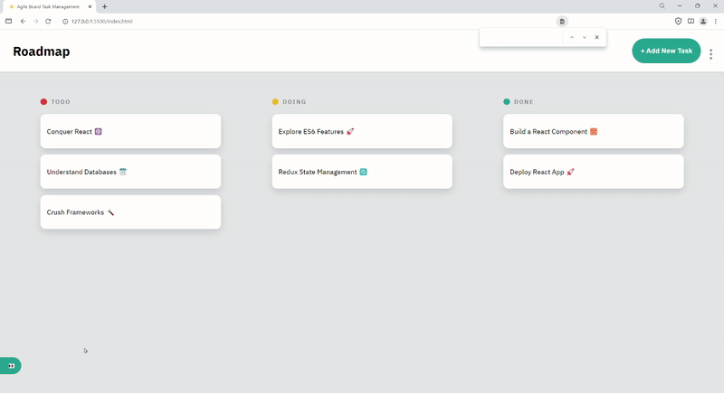

# [JSL11] Agile Board - Kanban Task Management App

## Project Overview

As a newly hired developer at Agile Board, a fictional company specializing in innovative task management solutions, we embarked on an exciting journey to enhance their flagship Kanban Task Management App.

In this Agile Board Project Feature List, we are introduced to a comprehensive suite of functionalities designed to enrich the Kanban Task Management App. 

As we embark on implementing these features, we tackled the project one small task at a time. This approach not only made the process more manageable but also ensures that we can focus on the quality of each feature, leading to a more robust and user-friendly application.Our journey through this project is a great opportunity to apply and hone our skills.

# Tech Stack
 * HTML
 * CSS 
 * JavaScript

# Content
 * Side bar navigator
 * Button to show side bar
 * Button to close side bar
 * Toggle switch for dark and light mode
 * Branches (Launch career or Roadmap)
 * Columns for To-do, doing and done
 * Add task button
 * modal to edit task
 
# Area of Mastery
 * DOM manipulation
 * Utilizing Objects
 * Utilizing localstorage
 * JSON methods
 * Array methods
 * Event listeners usage
 * Ternary operators
 * Conditional operators
 * Debugging
 * Loops and iterations

# Challenges
The first challenge I had while working on this project was accessing the correct elements from the DOM and assigning them to the keys of the element object. The second problem I had was when I worked on the theme toggle function to get the logo to also change when I toggle the theme and when I refresh the page it should be on the logo image corresponding with the theme I had before I  refreshed. The third problem I had was when I had selected task and saved changes for them and went on to select another task to delete, it would then delete all the task I had previously saved the changes for and the task currently being deleted.

# What i learned
I learned a new way to use object in JavaScript by having providing elements assigned to the properties of keys inside objects which we can then access those elements using object.key through out the file. Also learned methods of chaining array methods with loops and also chaining array methods with other array methods. 

# Project Process
* I first started by importing function's from the other two JavaScript files into index.js.
* I then fetched all the elements which are needed throughout the file and assigned them as properties to the keys inside of the elements object which the keys will be using utilizing elements.key to access those elements throughout the file.
* I then debugged the code by fixing the ternary operators and fixed the strict equal signs and then fixed the click functions to be addeventlisteners for click and correctly called their functions.
* I then went on to work on the toggle side bar function which I fetched the body of the document and assigned it to a  variable which I styled the display to be either block or none based on the argument passed to the function and did the same for the side bar button which i collected from the elements object.
* I then worked on the toggle theme function, which I made the class of the body of the document to toggle the light-theme class. Then checked if the body contains the class light-theme which the boolean value is assigned to the variable isLightTheme which I used in the conditional operator which if true setsitems for the localstorage for both the logo and theme of the page and the else for which if false sets item which are different to both local storage. I then assigned the current logo name to the source of the logo image element.
* I then made some changes to the init function to check whether the property inside the logotheme local storage is equal to the light logo if true I assigned that logo to the image element source. I then changed the enable to disable for checking if the light-theme local storage has that value which i assign to isLightTheme variable which I use as a boolean to set the toggle of the class of the body and also used it to set the checkbox input to either be checked or not when refreshing the webpage.
* I worked on the openEditTaskModal function to assign the properties of the current task opened to the input values of that modal and then added buttons for saving and deleting which I assigned functions to the callback functions of the event listener for a click for those buttons.
* The saveTaskChange function inside the callback function of the save button event listener basically assigns the values of the input elements to variable which are used to be assigned as properties of keys inside the updatedTask object which is used in the patchTask function as an argument.
* I then worked on the addTask function which I assigned the inputted values of the elements to variables which are used in the task object as properties of the keys.
* I then added another toggleModal function to the filterDiv element for the eventlistener callback function so that when I press outside the edit modal it closes the modal.

 # Loom Presentation

https://www.loom.com/share/f2542473bae8464399350b558aaaad02?sid=7953a409-ad7c-49ff-8db3-5ee3ed518867

